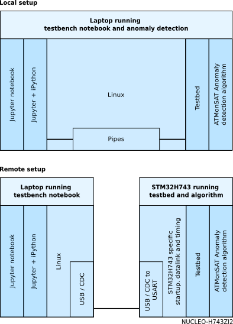
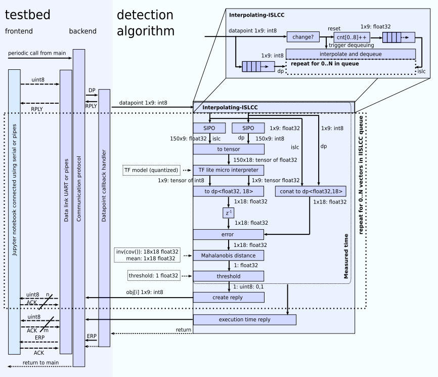
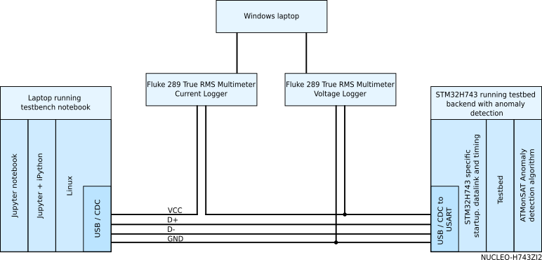
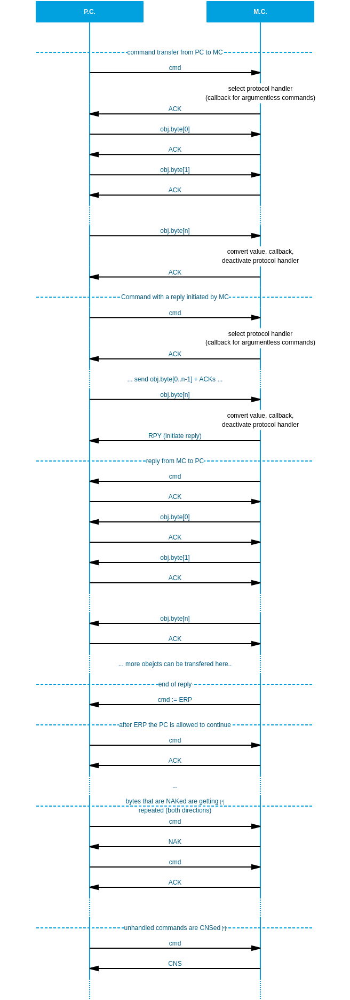

# C++ Implementation of the AtMonSAT Anomaly Detection Algorithm

> The project was partly funded by the European Space Agency (ESA) under the Open Space Innovation Platform (OSIP), under which ESA organizes and launches Campaigns and Channels to seek ideas related to space research, otherwise known as ESAIdeas.
> Reference: 
> ESA Contract No.~400134792/21/NL/GLC/my
> ESA activity description No.~I-2020-03332

The AtMonSAT anomaly detection algorithm has been implemented in C++ in a generic way such that it can be compiled for a PC as well as targeted to a microcontroller (e.g. STM32H743).  
It has been embedded in a testbed to allow verification of the performance and results.
Only a small part (e.g. the data link layer and the time metric) of this testbed is hardware dependent and must be exchanged for the PC and microcontroller versions.

*General overview and differences of the local and remote implementations*

## Testbed
The testbed consists of a frontend and backend. The frontend is running on the host (PC) and the backend is part of the target (PC or STM32).

### Frontend
The testbed frontend consists of a Jupyter notebook (*testbench/atmonsat_testbench.ipynb*) to control the experiment and to record and visualize the results. This notebook allows selecting the connection target (local or remote experiment), selecting the dataset and dataset range ('experiment', 'normal', 'anomaly') to be send to the target and changing the algorithm settings.

All settings and results are stored in a unique (timestamped) directory in the results subdirectory.

The testbench relies on the dataset notebook (*testbench/dataset.ipynb*) to provide the dataset data for each experiment and the connection notebook (*testbench/connection.ipynb*) to provide a reliable connection towards the target.

All datasets are stored in the datasets subdirectory. They contain a meta file (meta.json) to explain and 
correct the data and some directories with the raw data. The datasets can be accessed using the Dataset class in the dataset notebook.

### Backend

The backend consists of a hardware specific data link layer to accept data from the communication byte by byte and forward it to the hardware independent communication protocol.

The communication protocol reassembles the transmitted data into objects (e.g. datapoint, mahalanobis inverse covariance matrix) and calls a callback handler (such as the datapoint handler depicted below) once the object has been updated. 

The figure only shows the datapoint callback handler with the anomaly detection algorithm. Other simpler callbacks (e.g. initialization, inverse covariance matrix update) have been omitted for clarity. 

The datapoint callback handler's main purpose is to call one iteration of the the anomaly detection algorithm upon reception of a datapoint. Before doing so it starts the time measurement timer and stops it after it's completion. The datapoint callback handler then replies the execution time to the host. 

The callback handler also supplies the anomaly detection algorithm with the necessary callbacks to reply (e.g. detection, Mahalanobis distance, error messages) to the host. Those callbacks are exempt from the time measurement as they are part of the protocol and not of the anomaly detection algorithm. 

Communication direction is by default from host to target. It is a half duplex communication where every received byte is acknowledged by the peer. The design considerations here are that one USART (rx+tx) is sufficient and no multithreading is required.

The communication transports a stream of data containers of different types. This allows different content (identified by a cmd id) to be transmitted without modifying the protocol. A dedicated callback handler is called after the reception of each container type.

Every received byte is acknowledge to confirm the reception and to delay the communication until processing on the (slower) target is done. This allows working without buffers and interrupts which could disturb timing measurements.

Sending an reply (RPLY) instead of acknowledge (ACK) upon reception of a byte allows the target to change the communication direction from target to host until an end-of-reply (ERP) command is send. Reversing the communication direction allows the target send one or multiple reply objects (e.g. detection results and timing information) to the host.

The C++ implementation of the anomaly detection algorithm is build around a pre-trained deep-learning Tensorflow Lite Micro model. The algorithm is evaluated one the arrival of each datapoint.

The figure above shows a block diagram of the testbed on the left hand side which is calling the detection algorithm on the right hand side upon reception of a datapoint.

Datapoints are entered into the interpolating-ISLCC from where they are forwarded into two Serial-In-Parallel-Out (SIPO) blocks. The outputs of the two SIPOs are two windows (e.g. width 150) of datapoints that are getting applied as input to the tensorflow lite micro model after conversion to a float32 tensor.  

The output of the deep learning model is delayed by one iteration before getting compared against the new window values of that new iteration. The result of that comparison is the error that is getting measured with a Mahalanobis distance against a predefined mean. This distance is reported to the host.

The Mahalanobis distance is then passed to a threshold with an hold-off value (e.g. 60 samples) which results in the anomaly detection decision. This decision is then reported back to the host. 

## PC Implementation
The PC implementation has been targeted for a Linux (tested under Ubuntu 22.04) platform.

It consists of the testbench and the anomaly detection algorithm. The data link layer of the testbench uses pipes (stdin, stdout, stderr (for debugging purpose only)) for communication with the controlling jupyter notebook. The time metric is able to measure nanoseconds based on a Linux Kernel API. 

Building the PC implementation can be done by calling the Makefile 
~~~~~
make
~~~~~

The Placebo version (version without algorithm) can be build with 
~~~~~
make PLACEBO=1
~~~~~

The path to this binary has to be specified as one of the settings in the testbench jupyter notebook.

## Microcontroller implementation
The microcontroller implementation has been targeted towards an STM32H743 32bit ARM Cortex-M7 microcontroller. This is a 32-bit Arm Cortex-M7 core with double-precision FPU and L1 cache (16 kB of data and 16 kB of instruction cache).

Our implementation has been tested on a *[NUCLEO-H743ZI](https://www.st.com/en/evaluation-tools/nucleo-h743zi.html)* board.

The code can be build and uploaded using the *[STM32CubeIDE](https://www.st.com/en/development-tools/stm32cubeide.html)* from *[STMicroelectronics](https://www.st.com/)*.

Clock configuration functions are provided for 39MHz, 78MHz, 146MHz and 298MHz. 
These values have been selected to get a millisecond timer for timing measurements 
while fulfilling all core internal timing constraints. The active clock configuration can be selected in the *main_stm32.h*. This also adapts the communication baudrate. 

In the testbench jupyter notebook the clock frequency is one of the settings that must be 
changed before the communication. This automatically adapts the communication baudrate for 
that clock frequency on the host side.

The *POWER_MEASUREMENT* definition must be declared while making power measurements. 
This disables all unnecessary consumers (e.g. LEDs)

## Power measurement setup
Increase in power consumption of the microcontroller due to the anomaly detection algorithm
is estimated as the difference in power consumption of the placebo version of the firmware and the firmware including the anomaly detection algorithm.
Measuring the difference cancels the power consumption due to the testbench and other components on the development board.

Power is measured by recording the voltage and current with two Fluke 289 True RMS multimeters with logging capability. Samples are recorded every second. 
The samples consist of the RMS average value of the voltage or current during that second.

During post processing the voltage and current logs are realigned and the voltage and current values then multiplied to give a power trace of the experiment.
Mean and standard deviation of that power trace is calculated and reported *power_statistics.json*. The raw data is available as csv files.

## Postprocessing
All the data of the experiments is stored in raw format.
To visualize and aggregate the information a number of postprocessing notebooks are available.

It is sufficient to run the main postprocessing notebook (*postprocessing.ipynb*) which then
applies all other postprocessing notebooks to the data.

Please note that the postprocessing notebook works on a directory called *measurements* whereas testbench stores the data in
the *results* directory. The data has to be copied by hand. (or the mesurement_root directory name can be adapted in the postprocessing notebook)

This is done on purpose to prevent automatically adding results from a test run into the measurements directory.

Generated plots and data for each measurement can be found inside that measurement directory.
Aggregated data is stored inside the measurements directory.

## Build

### Native 
~~~~~
cd firmwares
./prepare.sh native
cd atmonsat_native
make
~~~~~

### STM32
~~~~~
cd firmwares
./prepare.sh baremetal
~~~~~

Then in STM32CubeIDE
- Create workspace 
- Import firmware (e.g. atmonsat_baremetal) into this workspace 
- Build 

## Communication Diagram

## Licenses

| Component                       | License              | Copyright |
|:---------                       |:-------              |:----------|
| AtMonSat                        | Apache License 2.0   | Copyright 2022 University of Luxembourg | 
| Tensorflow Lite Micro           | Apache License 2.0   | Copyright 2022 The TensorFlow Authors|
| CMSIS                           | Apache License 2.0   | Copyright (c) 2009-2022 ARM Limited. |
| CMSIS Device                    | Apache License 2.0   | ARM Limited - STMicroelectronics |
| STM32H743 HAL                   | BSD-3-Clause         | STMicroelectronics |
| FreeRTOS kernel                 | MIT                  | Copyright (C) 2022 Amazon Web Services, Inc. |

